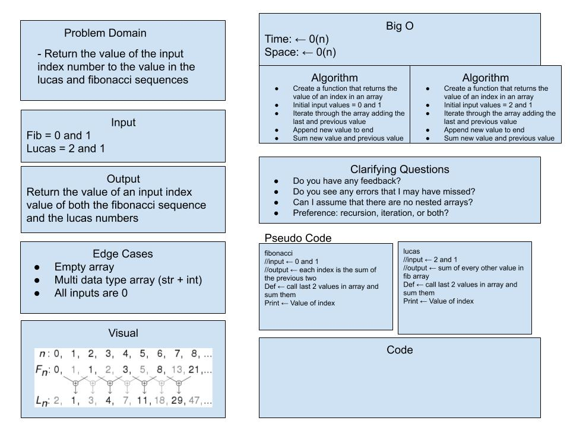

# math-series

## Lab: 02 - Modules, Containers, and Testing

*Author: Amber Falbo*

----

## Overview

The Fibonacci Series is a numeric series starting with the integers 0 and 1. In this series, the next integer is determined by summing the previous two.

The Lucas Numbers are a related series of integers that start with the values 2 and 1 rather than 0 and 1.

---

### Getting Started
Clone this repository to your local machine.

```
$ git clone [https://github.com/AmberFalbo/math-series.git]
```

### To run the program from VS Code:
Select ```File``` -> ```Open``` -> ```Project/Solution```

Next navigate to the location you cloned the Repository.

Double click on the ```Lab01-About-Me``` directory.

Then select and open ```AboutMe.py```

---

### Visuals
